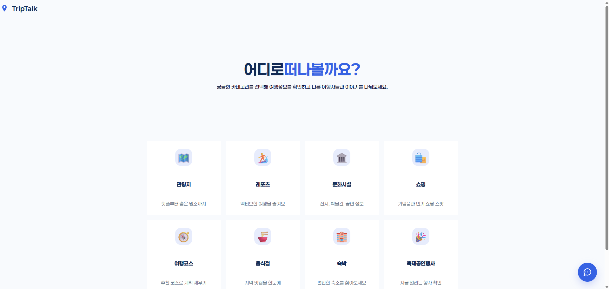
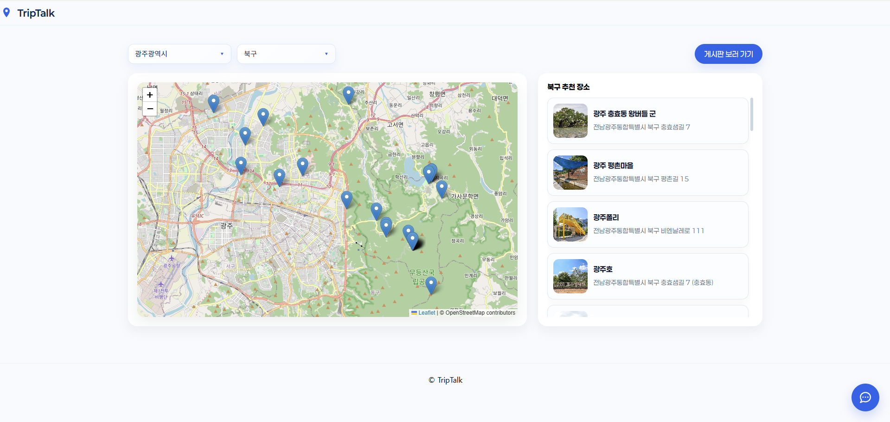
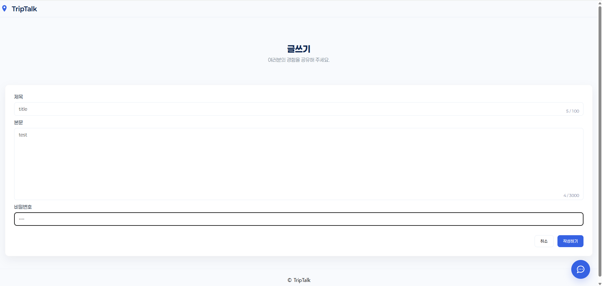
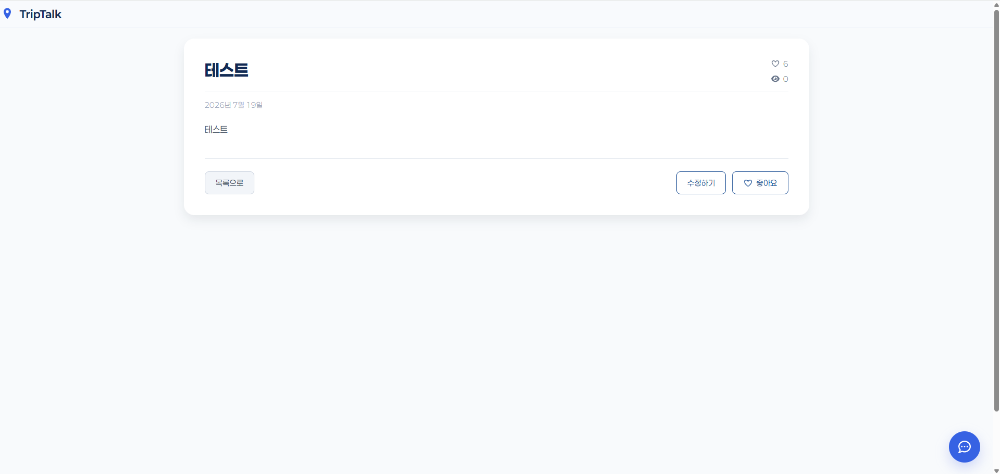
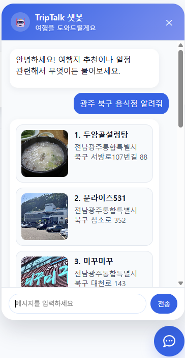

# 🌍 TripTalk

> **전라도 기반 통합 여행 커뮤니티 웹 서비스**

TripTalk은 전라도 지역의 관광지, 숙박, 음식점 정보 등을 한곳에서 확인하고, 사용자들이 자유롭게 정보를 공유할 수 있는 **지역 특화 여행 커뮤니티 플랫폼**입니다.

지도 기반으로 원하는 장소를 쉽게 탐색할 수 있으며, 카테고리별 게시판과 AI 챗봇을 통해 여행 정보를 더욱 편리하게 제공합니다.

---

## 📌 프로젝트 소개

기존 여행 서비스는 관광 정보와 사용자 커뮤니티가 분리되어 있어 원하는 정보를 찾기 위해 여러 서비스를 이용해야 하는 불편함이 있습니다.

TripTalk은 이러한 문제를 해결하기 위해 **관광 정보 조회 + 커뮤니티 + AI 챗봇** 기능을 하나의 서비스에서 제공합니다.

### 주요 기능
- 🗺️ 지도 기반 관광 정보 제공
- 🍽️ 관광지 / 음식점 / 숙박 등 다양한 정보 조회
- 💬 카테고리별 자유 게시판
- 🤖 OpenAI 기반 여행 정보 챗봇

---

# 🛠 Tech Stack

### Front-End
- Vue.js
- Leaflet

### Back-End
- FastAPI
- SQLite

### AI
- OpenAI API

---

# ✨ 주요 기능

## 1. 메인 페이지

### 기능
- 카테고리 선택

### 수행 화면



---

## 2. 지도 기반 관광 정보 조회

### 기능

Leaflet 지도를 활용하여 전라도 지역의 관광 정보를 제공합니다.

제공 정보

- 이름
- 주소
- 이미지
- 전화번호

사용자는 지도 위 마커를 통해 위치를 확인할 수 있으며 상세 정보를 확인할 수 있습니다.

### 수행 화면



---

## 3. 커뮤니티 게시판

### 기능

장소에 대한 자유로운 후기 및 정보를 작성하고 공유할 수 있습니다.

- 게시글 작성
- 게시글 조회(최신순, 추천순)
- 게시글 수정
- 게시글 삭제
- 게시글 좋아요

### 수행 화면






---

## 4. AI 여행 챗봇

### 기능

OpenAI API를 활용한 지역 정보 챗봇입니다.

예시

```
광주광역시 북구 맛집 알려줘
```

```
담양 관광지 추천해줘
```

```
전주에서 유명한 음식은?
```

사용자의 질문을 분석하여 지역 기반 관광 정보를 제공합니다.

### 수행 화면



---

# 🚀 배포

### 서비스 URL

- [프론트 URL](https://triptalkweb.netlify.app/)
- [백엔드 URL](https://triptalk-backend.onrender.com)

---

# 👨‍💻 프로젝트 진행

## 개발 기간

> 2026.07.14 ~ 2026.07.16

---

## 개발 목적

전라도 지역의 여행 정보를 보다 쉽고 편리하게 제공하고,

사용자 간의 정보 공유가 가능한 커뮤니티 서비스를 구축하는 것을 목표로 개발하였습니다.

또한 AI 챗봇을 통해 원하는 여행 정보를 자연어로 쉽게 검색할 수 있도록 구현하였습니다.

---

## 역할

### Front-End
- Vue.js 화면 구현
- Leaflet 지도 기능 구현
- 게시판 UI 구현

### Back-End
- FastAPI API 개발
- SQLite 데이터베이스 설계
- 게시판 CRUD 구현

### AI
- OpenAI API 연동
- 여행 정보 질의응답 챗봇 구현

---

# 💡 향후 개선 사항

- 회원관리 및 맞춤형 정보 제공
- 댓글 기능 추가
- 즐겨찾기 기능
- 여행 일정 추천
- 이미지 업로드 기능
- 관광지 리뷰 평점 기능
- 실시간 인기 여행지 제공